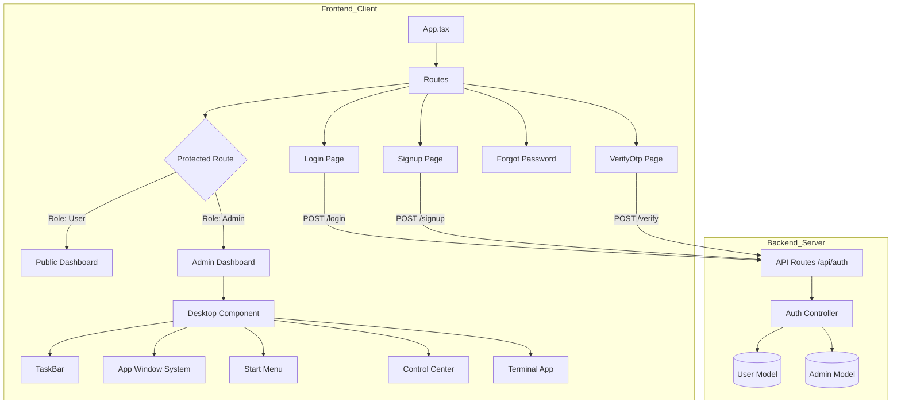

# Auth & Dashboard System (MERN Stack)

A full-stack authentication and dashboard application built with the MERN stack (MongoDB, Express, React, Node.js). This project features a robust authentication system with role-based access control (RBAC), OTP verification, and a rich "Desktop Environment" style UI for the admin dashboard.

## 🚀 Features

- **Authentication & Security**:
  - User & Admin Signup/Login
  - Email OTP Verification
  - Forgot/Reset Password Flow
  - JWT-based session management
  - Role-Based Access Control (Admin vs. User routes)
- **Frontend UI (Desktop OS Style)**:
  - Interactive Desktop Environment (Start Menu, Taskbar, Windows)
  - Draggable & Resizable Windows
  - Terminal, Control Center, and Notification System
  - Dark/Light mode support (via system/settings)
- **Backend**:
  - RESTful API architecture
  - MongoDB with Mongoose schemas
  - Secure password hashing (bcryptjs)

## 🛠 Tech Stack

### Client (Frontend)

- **Framework**: React (Vite)
- **Language**: TypeScript
- **Styling**: Tailwind CSS
- **Routing**: React Router DOM
- **State/HTTP**: Axios, Context API
- **Icons**: React Icons

### Server (Backend)

- **Runtime**: Node.js
- **Framework**: Express.js
- **Database**: MongoDB (Mongoose)
- **Authentication**: JSON Web Tokens (JWT), bcryptjs
- **Email Services**: Nodemailer / Resend

---

## 🗺️ Structured Map & Architecture

This map illustrates the relationship between Pages, Components, and Backend Services.



### 📂 File Structure & Connections

#### **Client (`/client/src`)**

- **`App.tsx`** (Main Entry)
  - ├── **`pages/`**
  - │ ├── `Login.tsx` (Auth Entry)
  - │ ├── `Signup.tsx` (Auth Entry)
  - │ ├── `VerifyOtp.tsx` (Step 2 of Auth)
  - │ ├── `publicDashboard.tsx` (User View)
  - │ └── **`admin/`**
  - │ └── `adminDashboard.tsx` (The "OS" Interface)
  - └── **`components/`**
  -       ├── `ProtectedRoute.tsx` (Security Guard)
  -       ├── `Desktop.tsx` (Main Layout for Admin)
  -       ├── `TaskBar.tsx` (Navigation)
  -       ├── `AppWindow.tsx` (Window functionality)
  -       ├── `Terminal.tsx` (Interactive CLI UI)
  -       └── `ControlCenter.tsx` (Quick Settings)

#### **Server (`/server/src`)**

- **`index.ts`** (Server Entry)
  - └── **`routes/`**
    - └── `authRoutes.ts` (Defines API Endpoints)
      - └── `POST /register`
      - └── `POST /login`
      - └── `POST /verify-otp`
  - └── **`controllers/`**
    - └── `authController.ts` (Business Logic) (Brain of the server)
  - └── **`models/`**
    - ├── `User.ts` (Schema for Standard Users)
    - └── `Admin.ts` (Schema for Privileged Users)

---

## ⚡ Getting Started

### 1. Prerequisites

- Node.js (v18+)
- MongoDB (Local or Atlas URI)

### 2. Installation

**Clone the repository:**

```bash
git clone <repository_url>
cd <project_directory>
```

**Setup Server:**

```bash
cd server
npm install
# Create .env file
echo "MONGO_URI=your_mongodb_uri" > .env
echo "JWT_SECRET=your_secret_key" >> .env
echo "PORT=5000" >> .env
npm run dev
```

**Setup Client:**

```bash
cd client
npm install
npm run dev
```

### 3. Usage

- **User Flow**: Signup -> Verify OTP -> Login -> Redirect to Public Dashboard.
- **Admin Flow**: Login (as Admin) -> Redirect to Admin Dashboard (Desktop UI).

## 📜 License

[MIT](LICENSE)
